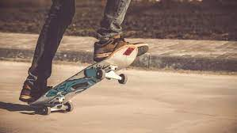

<h1>Sk8 - Picos</h1>

 Projeto realizado durante minha formação em front-end junto à Alura. Realizei a criação de uma interface para um aplicativo que visa indicar picos para a prática de skate. Se você curte skate, está ai uma boa ideia para seu rolê e para meu aprendizado.

Durante esse projeto utilizei diversos conceitos e propriedades sobre flexbox e também grid layout, além de aperfeiçoar meus conhecimentos em desenvolvimento de interfaces responsivas.
